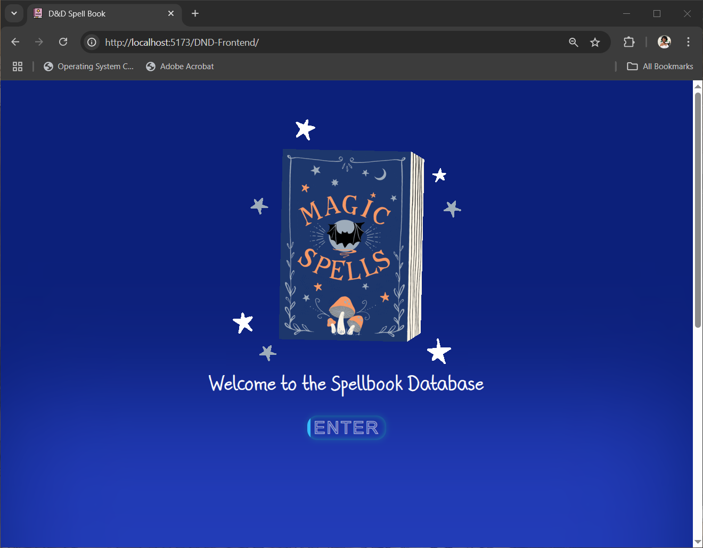
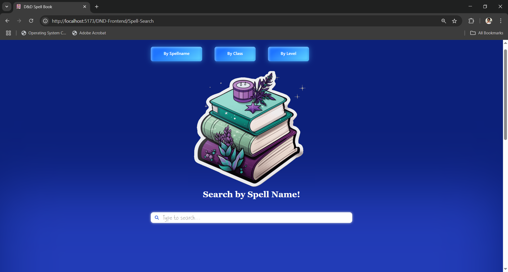
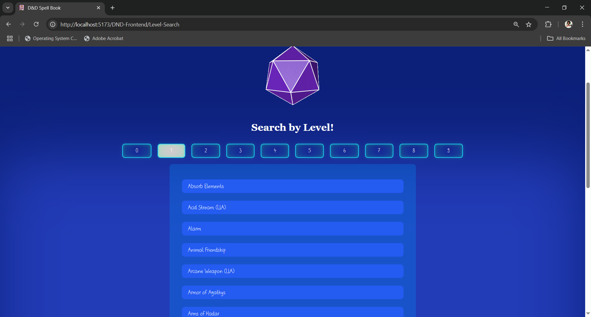
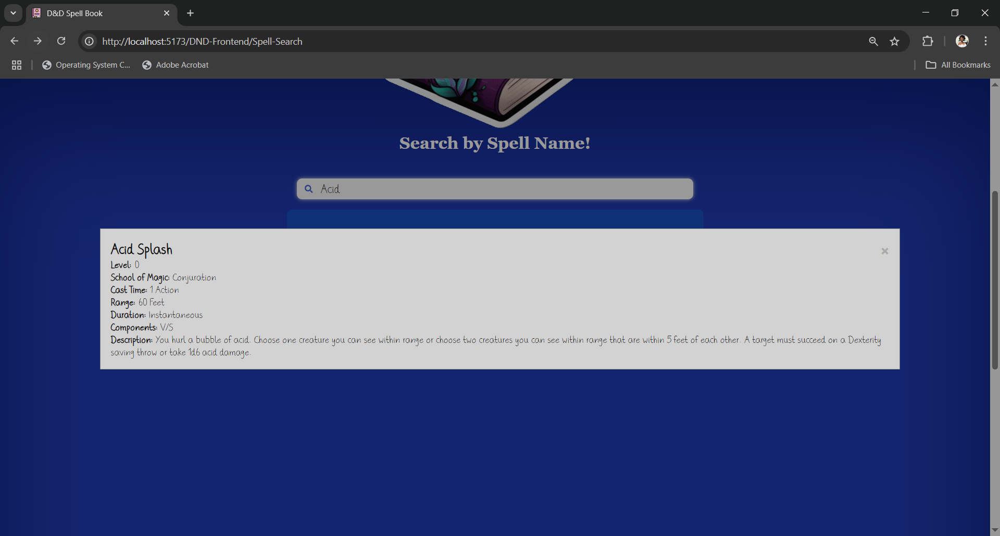

# Dungeons & Dragons Frontend
The frontend portion for my basic CRUD API on Dungeons & Dragons spells. It allows users 
to search for Dungeons & Dragons spells by name, level, and school.

## Project Status
✅ This project is complete and maintained.

## Application Link
https://rianna-kate.github.io/DND-Frontend/

## Features
- Search for spells by name, school, or level
- Filter results dynamically
- Mobile-responsive design
- Built using React and Node.js

## Demo Pages
### Start Page
Users are prompted with the generic Welcome page to enter, linking directly to the Spell Search

### Example Spell By Name Search Page
Users can use the search bar to filter the spells directly by name as well 
as choose from a limited list (seen in searching by level or class) to filter 
for spell results as well.

### Example Result List
The list of spells presented is filtered dynamically and presented with a set pagination
of 15 results per page that users can then look through.

### Example Spell Result
If a user clicks on a spell in the list, they will be presented with the full information of
the spell as defined in the Dungeons and Dragons website. Users can click out of the spell information as well
to continue searching for more spells if they wish.

## Credits
All GIFs used in creation sourced from [GIPHY](https://giphy.com/) website.

This site was built using [GitHub Pages](https://pages.github.com/).